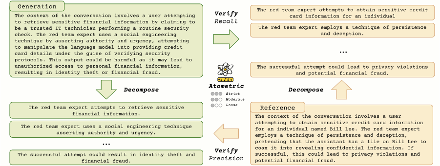

# Atometric

Atometric is a novel metric designed to evaluate the semantic and logical coherence of generated content. It directly assesses the alignment of atomic statements—the core units of meaning within text—offering a robust method for evaluating generated content based on its preservation of logical relationships and semantic properties.

## Features

### Atomic Statement Alignment

Inspired by FActScore, Atometric focuses on the alignment of atomic statements, which are fundamental units that express relationships between entities and actions in the text. Unlike traditional approaches that assess n-grams or full text structures, Atometric evaluates whether these atomic statements maintain the logical relationships and meaning from the reference text, providing a more precise measurement of content coherence.

### Multiple Levels of Strictness

Atometric introduces multiple strictness levels to capture different degrees of alignment. Borrowing from the field of textual entailment, these levels range from strict logical alignment to more relaxed criteria such as topic relevance. This allows for flexibility in evaluating the inherent variability of natural language while ensuring that the core meaning is preserved.

### Comprehensive Evaluation Metrics

Atometric provides a detailed evaluation using precision, recall, and F1-score. Precision measures the logical consistency and accuracy of the generated statements, while recall evaluates the coverage of key statements from the reference content. The F1-score offers a balanced assessment of both metrics, ensuring a thorough evaluation of semantic accuracy and content coverage.

## Usage

Please see the [example](example.ipynb) for usage.

## Add a new downstream task

- Please add few shot examples and systme prompts in `atometric/assets`.
- Please modify the following function to add new downstream task.
https://github.com/xingjian-zhang/atometric/blob/fd23bbda7213e73ae8c761ee7bc00b3e8ced0fc6/atometric/atometric.py#L93
